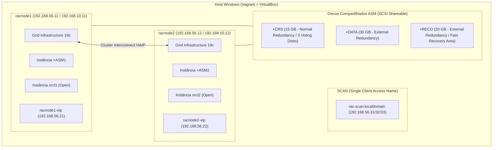

# Oracle Database 19c RAC (2 Nós) - Oracle Linux 9 no VirtualBox & Vagrant

Ambiente de automação completa para provisionamento, configuração e orquestração de um cluster **Oracle Real Application Clusters (RAC) 19c (19.3)** de 2 nós (`racnode1` e `racnode2`) sobre **Oracle Linux 9 (UEK7 / Kernel 6.12)** com **Oracle Automatic Storage Management (ASM)**, **Grid Infrastructure** e **Multitenant Database (CDB/PDB)** utilizando discos compartilhados VirtualBox.

---

## 🏛️ Visão Geral da Arquitetura

- **Sistema Operacional:** Oracle Linux 9 (UEK7 / Kernel 6.12, glibc 2.34)
- **Nós do Cluster:** 2 nós (`racnode1.localdomain`, `racnode2.localdomain`)
- **Oracle Grid Infrastructure:** 19c (19.3.0.0.0 Enterprise Edition)
- **Oracle Database (RDBMS):** 19c (19.3.0.0.0 Enterprise Edition Multitenant)
- **Container Database (CDB):** `orcl` (Instâncias ativas: `orcl1` no Nó 1, `orcl2` no Nó 2)
- **Pluggable Database (PDB):** `orclpdb`
- **Gerenciamento de Armazenamento:** Oracle ASM com regras persistentes UDEV



---

## 💾 Topologia de Armazenamento ASM

Os discos virtuais são configurados como SCSI compartilhados (`shareable`) e mapeados deterministicamente no Linux através de regras de UDEV (`/dev/oracleasm/disks/*`) com permissões `grid:asmadmin`:

| Diskgroup | Discos / UDEV Links | Tamanho Total | Redundância | Finalidade Principal |
| :--- | :--- | :--- | :--- | :--- |
| **`+CRS`** | `/dev/oracleasm/disks/asm-crs01`<br>`/dev/oracleasm/disks/asm-crs02`<br>`/dev/oracleasm/disks/asm-crs03` | 15 GB (3x 5GB) | **NORMAL** | Oracle Cluster Registry (OCR) e 3 Voting Disks |
| **`+DATA`** | `/dev/oracleasm/disks/asm-data01` | 30 GB | **EXTERNAL** | Datafiles, Controlfiles, Redo Logs, SYSTEM/SYSAUX |
| **`+RECO`** | `/dev/oracleasm/disks/asm-reco01` | 20 GB | **EXTERNAL** | Fast Recovery Area (FRA), Arquivos de Redo e Archive Logs |

---

## 🌐 Topologia de Rede

| Hostname | Interface | IP / Subnet | Tipo / Função |
| :--- | :--- | :--- | :--- |
| `racnode1` | `eth1` | `192.168.56.11` / `255.255.255.0` | IP Público / Gestão |
| `racnode1-vip` | `eth1:1` | `192.168.56.21` / `255.255.255.0` | Virtual IP (Failover) |
| `racnode1-priv` | `eth2` | `192.168.10.11` / `255.255.255.0` | Cluster Interconnect / HAIP |
| `racnode2` | `eth1` | `192.168.56.12` / `255.255.255.0` | IP Público / Gestão |
| `racnode2-vip` | `eth1:1` | `192.168.56.22` / `255.255.255.0` | Virtual IP (Failover) |
| `racnode2-priv` | `eth2` | `192.168.10.12` / `255.255.255.0` | Cluster Interconnect / HAIP |
| `rac-scan` | DNS Round-Robin | `192.168.56.31`, `.32`, `.33` | SCAN VIP & SCAN Listeners |

---

## 💻 Pré-requisitos de Hardware e Software

- **Sistema Operacional do Host:** Windows 10/11 x64 ou Linux x86_64
- **Hypervisor:** Oracle VirtualBox 7.0+
- **Orquestrador:** HashiCorp Vagrant 2.3+
- **Memória RAM Host Recomendada:** Mínimo de 16 GB livres (recomendado 32 GB no host para estabilidade de I/O)
- **Recursos por VM:**
  - **RAM:** 6144 MB (6 GB) por nó
  - **Swap:** 4096 MB (4 GB) por nó
  - **vCPUs:** 2 vCPUs por nó
- **Armazenamento:** 80 GB livres em SSD / NVMe

---

## 🛠️ Solução de Problemas Críticos (Troubleshooting & Workarounds)

### 1. Compatibilidade GLIBC 2.34 (Oracle Linux 9) x Oracle 19c Linker
No Oracle Linux 9, a biblioteca C removeu símbolos estáticos legados como `stat`, `lstat` e `fstat` em favor de suas variantes `__xstat`. Para viabilizar a compilação e linkagem de binários do Grid e do Database 19c sem erros de linkers (`libpthread_nonshared.a` e referências indefinidas):
- Criação de stub estático `/usr/lib64/libpthread_nonshared.a`.
- Criação e injeção do shim `/usr/lib64/libstat_shim.a` contendo mapeamento das chamadas de stat e inclusão no `$ORACLE_HOME/lib/sysliblist` e `$GRID_HOME/lib/sysliblist` (`-lstat_shim`).

### 2. Sincronismo de Clock CTSS vs Chrony
Para evitar que o Cluster Synchronization Service daemon (CSSD) ou o Cluster Time Synchronization Service (CTSS) entrem em conflito com o daemon NTP local:
- O serviço `chronyd` foi desativado e mascarado (`systemctl mask chronyd`), permitindo que o CTSS assuma o sincronismo de tempo em modo ativo/passivo entre os nós do cluster.

### 3. Contorno de Checagens do Cluster Verification Utility (CVU)
Como o Oracle 19.3 foi concebido antes da distribuição OL9:
- Definida a variável `export CV_ASSUME_DISTID=OL8` antes da execução dos instaladores (`gridSetup.sh`, `runInstaller` e `dbca`).
- Utilização dos parâmetros `-ignorePrereq` e `-ignorePrereqFailure` para ignorar alertas cosméticos de laboratório.

---

## 🚀 Guia de Execução Passo a Passo

### 1. Posicionamento dos Binários Oficiais Oracle
Coloque os arquivos compactados na pasta `software/` na raiz do projeto:
- `V982068-01.zip` (Oracle Grid Infrastructure 19.3)
- `V982063-01.zip` (Oracle Database Enterprise Edition 19.3)

### 2. Inicialização do Ambiente
```powershell
# Iniciar o provisionamento e subir as VMs
vagrant up
```

### 3. Desligamento e Religamento Seguro do Cluster

Para manter a consistência dos discos ASM e dos voting disks ao reiniciar o host:

```powershell
# Desligamento Gracioso (Recomendado)
# Primeiro desliga racnode2, depois racnode1:
vagrant halt racnode2
vagrant halt racnode1

# Inicialização (Primeiro racnode1, depois racnode2):
vagrant up racnode1 --no-provision
vagrant up racnode2 --no-provision
```

---

## 🔍 Guia de Validação Operacional

### 1. Verificar Saúde Geral do Clusterware
```bash
sudo su - grid -c "crsctl check cluster -all"
```
*Saída esperada:* CRS, CSS e EVM com status `online` em ambos os nós.

### 2. Listar Recursos do Cluster
```bash
sudo su - grid -c "crsctl stat res -t"
```

### 3. Verificar Diskgroups ASM e Voting Disks
```bash
sudo su - grid -c "crsctl query css votedisk"
sudo su - grid -c "asmcmd lsdg"
```

### 4. Verificar Status do Banco de Dados RAC
```bash
sudo su - oracle -c "srvctl status database -d orcl"
sudo su - oracle -c "srvctl config database -d orcl"
```

### 5. Consulta de Instâncias e PDBs via SQL*Plus
```bash
sudo su - oracle -c "sqlplus / as sysdba"
```
```sql
SET LINESIZE 200 COLSEP '|';
SELECT inst_id, instance_name, host_name, status, startup_time FROM gv$instance;
SELECT name, open_mode FROM v$pdbs;
EXIT;
```
